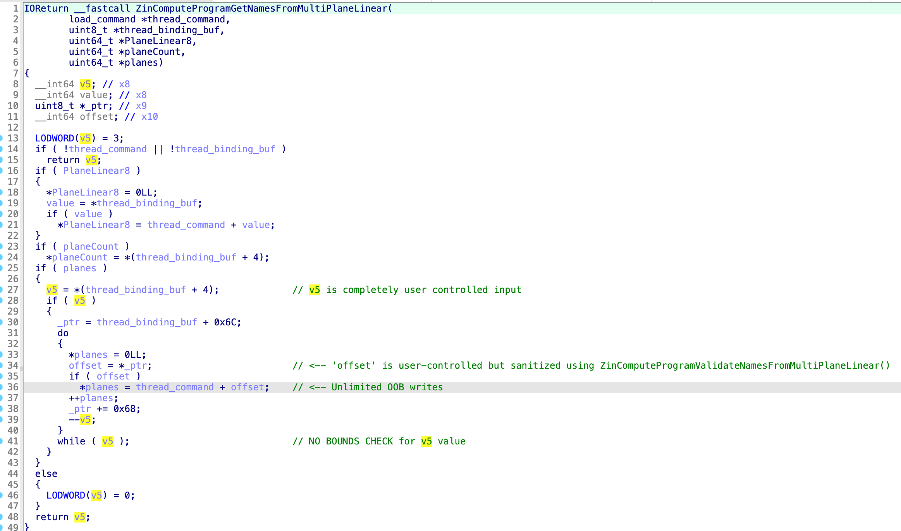

# CVE-2022-32898: ANE_ProgramCreate() multiple kernel memory corruption

Nov 23, 2022 • Mohamed GHANNAM (@_simo36)

## Intro:

While reverse-engineering the process of which the Apple Neural Engine loads a model in the kernel level, I identified two interesting memory corruption vulnerabilities in the code responsible for processing the neural network features in H11ANEIn::ANE_ProgramCreate_gated(). These kind of vulnerabilities, in my opinion, are easy to find when manually auditing the kernel driver, but nearly impossible to catch with fuzzers unless you build something incredibly sophisticated.

## Analysis:

The ZinComputeProgramGetNamesFromMultiPlaneLinear() and ZinComputeProgramGetNamesFromMultiPlaneTiledCompressed() functions are both responsible for parsing the procedure input and output, or more precisely, the LC_THREAD command with thread flavor 2 (ane_bind_state) whose binding_type_info value is 4 and 5.

From what I can tell, binding_type_info = 4 means that a procedure’s input has more than one plane, and binding_type_info = 5 means that the input not only has more than one plane but is also compressed.

The ZinComputeProgramGetNamesFromMultiPlaneLinear() function for example takes 5 arguments: a load command pointer, a thread binding pointer, and three extra output arguments. The last output argument planes is an array that will hold planes, or kernel pointers, whose contents are controlled by the user, and the last argument planeCount will indicate how many planes (or kernel pointers) were copied into planes from the model.hwx file. The following is the function definition:

Due to the lack of validation of how many planes a model can supply, kernel pointers could be written outside the bounds of the planes array, potentially leading to a many interesting memory corruption scenarios.

## Turning the memory corruption to stack overflow:

The planes array is a stack variable located in H11ANEIn::ANE_ProgramCreate_gated(), and by overflowing this variable (which is supposed to hold multiple planes up to 4 elements) with more than 4 planes, other stack variables could be corrupted as well, which could lead to other issues such as type-confusion since the overwriting kernel pointers are completely under user control.

Obviously, overflowing the planes array with too much entries would likely overwrite the stack cookie as well as the saved old stack frame pointer, resulting in a kernel panic. Fortunately, the total number of planes is entirely within the control of the given model, thus we could corrupt several stack variables without affecting those sensitive areas of the stack.

## Turning the memory corruption to heap overflow:

Another interesting scenario, and as illustrated in the image below, it is possible to overflow two heap objects: H11ANEProgramBindingInfo (at line 528) and H11ANEProgramCreateArgsStructOutput (at line 533).

struct H11ANEProgramBindingInfo
{
        struct {
                uint32_t field_0;
                char names[8][512];
                uint32_t field_1004;
                char *procedure_name;
        } inputs[255], outputs[255];

};

